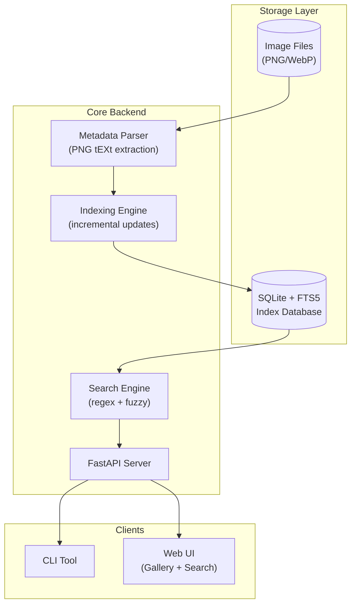

# ComfyUI Metadata Indexer - Implementation Plan

A multi-user image metadata indexing system for ComfyUI-generated images, providing powerful search capabilities through a REST API, CLI, and modern WebUI.

## Architecture Overview



## User Review Required

> [!IMPORTANT]
> **Technology Choices** - Please confirm these selections:
> - **Backend**: Python 3.10+ with FastAPI
> - **Database**: SQLite with FTS5 for full-text search (portable, zero-config)
> - **Frontend**: Vanilla JS with modern CSS (no heavy frameworks)
> - **Fuzzy Search**: rapidfuzz library for Levenshtein-based matching

> [!WARNING]
> **Image Serving** - The WebUI will need access to serve images. Two options:
> 1. **Symlink/Copy**: Copy thumbnails to a static folder (uses disk space)
> 2. **Proxy**: API proxies image requests from original locations (requires original paths accessible)
> 
> **Recommendation**: Option 2 (proxy) - keeps images in place, generates thumbnails on-demand with caching.

---

## Proposed Changes

### Project Structure

```
f:\ImageBrowsingParsing\
├── comfyui_indexer/           # Python package
│   ├── __init__.py
│   ├── parser.py              # PNG metadata extraction
│   ├── indexer.py             # Database operations & indexing
│   ├── search.py              # Search engine (regex + fuzzy)
│   ├── api/
│   │   ├── __init__.py
│   │   ├── main.py            # FastAPI app
│   │   ├── routes/
│   │   │   ├── images.py      # Image endpoints
│   │   │   ├── search.py      # Search endpoints
│   │   │   └── index.py       # Index management
│   │   └── models.py          # Pydantic schemas
│   └── cli.py                 # CLI interface
├── web/                       # Frontend
│   ├── index.html
│   ├── css/
│   │   └── styles.css
│   └── js/
│       ├── app.js
│       ├── gallery.js
│       └── search.js
├── tests/
├── pyproject.toml
└── README.md
```

---

### Core Backend

#### [NEW] [parser.py](file:///f:/ImageBrowsingParsing/comfyui_indexer/parser.py)

Extracts metadata from PNG/WebP files:
- Read PNG `tEXt` chunks for `prompt` and `workflow` keys
- Parse JSON structures from ComfyUI format
- Extract key fields:
  - **Prompt fields**: Keys containing "text", "STRING", prompt-like content
  - **Model references**: `model_name`, `ckpt_name`, `clip_name`, values ending in `.safetensors`
  - **Parameters**: Steps, CFG, sampler, seed, dimensions
  - **Node types**: List of all node class types used

#### [NEW] [indexer.py](file:///f:/ImageBrowsingParsing/comfyui_indexer/indexer.py)

SQLite database with FTS5 full-text search:

```sql
-- Main images table
CREATE TABLE images (
    id INTEGER PRIMARY KEY,
    file_path TEXT UNIQUE NOT NULL,
    file_hash TEXT NOT NULL,           -- For change detection
    file_size INTEGER,
    created_at TIMESTAMP,
    modified_at TIMESTAMP,
    width INTEGER,
    height INTEGER,
    raw_prompt JSON,                   -- Original prompt JSON
    raw_workflow JSON                  -- Original workflow JSON
);

-- Extracted metadata (normalized)
CREATE TABLE metadata (
    id INTEGER PRIMARY KEY,
    image_id INTEGER REFERENCES images(id),
    key TEXT NOT NULL,                 -- e.g., "model_name", "positive_prompt"
    value TEXT,
    node_type TEXT,                    -- ComfyUI node class
    node_id TEXT
);

-- Full-text search virtual table
CREATE VIRTUAL TABLE metadata_fts USING fts5(
    key, value, content='metadata', content_rowid='id'
);

-- Index for .safetensors searches
CREATE INDEX idx_metadata_value ON metadata(value) WHERE value LIKE '%.safetensors';
```

Features:
- **Incremental updates**: Hash-based change detection, only re-index modified files
- **Batch processing**: Process files in batches for memory efficiency
- **Multi-directory support**: Watch multiple image directories

---

#### [NEW] [search.py](file:///f:/ImageBrowsingParsing/comfyui_indexer/search.py)

Dual search modes:
1. **Regex Search**: Full regex support via SQLite REGEXP function
2. **Fuzzy Search**: rapidfuzz library with configurable threshold

```python
# Example search API
class SearchEngine:
    def search_regex(self, pattern: str, field: str = None) -> List[SearchResult]
    def search_fuzzy(self, query: str, threshold: float = 0.7) -> List[SearchResult]
    def search_models(self, pattern: str = "*.safetensors") -> List[SearchResult]
    def search_prompts(self, text: str, fuzzy: bool = True) -> List[SearchResult]
```

---

#### [NEW] [api/main.py](file:///f:/ImageBrowsingParsing/comfyui_indexer/api/main.py)

FastAPI endpoints:

| Method | Endpoint | Description |
|--------|----------|-------------|
| `GET` | `/api/search` | Search with query params (mode, field, limit) |
| `GET` | `/api/images` | List images with pagination & filters |
| `GET` | `/api/images/{id}` | Get image details + full metadata |
| `GET` | `/api/images/{id}/thumbnail` | Get/generate thumbnail |
| `GET` | `/api/images/{id}/file` | Serve original image |
| `POST` | `/api/index/scan` | Trigger directory scan |
| `GET` | `/api/index/status` | Get indexing status |
| `GET` | `/api/stats` | Database statistics |

---

### CLI Tool

#### [NEW] [cli.py](file:///f:/ImageBrowsingParsing/comfyui_indexer/cli.py)

Commands using Typer:

```bash
# Index management
comfy-idx scan <directory> [--recursive] [--force]
comfy-idx status
comfy-idx stats

# Search
comfy-idx search "portrait" --fuzzy --limit 20
comfy-idx search "model_name:.*xl.*" --regex
comfy-idx models                          # List all models used
comfy-idx prompts --contains "cyberpunk"  # Search prompts

# Server
comfy-idx serve --port 8000
```

---

### Web UI

#### [NEW] [web/index.html](file:///f:/ImageBrowsingParsing/web/index.html)

Modern single-page application with:
- **Header**: Logo, search bar, mode toggle (regex/fuzzy)
- **Sidebar**: Filters (models, date range, dimensions)
- **Main content**: Tabbed view (Search Results / Gallery)
- **Lightbox**: Full-screen image overlay with metadata panel

#### [NEW] [web/css/styles.css](file:///f:/ImageBrowsingParsing/web/css/styles.css)

Design system featuring:
- Dark theme with accent colors
- CSS Grid for responsive gallery
- Glassmorphism search bar
- Smooth transitions and hover effects
- CSS custom properties for theming

#### [NEW] [web/js/app.js](file:///f:/ImageBrowsingParsing/web/js/app.js)

Core application logic:
- API client wrapper
- State management
- Route handling (hash-based)
- Keyboard shortcuts (arrow keys in gallery, ESC to close)

---

## Verification Plan

### Automated Tests

```bash
# Unit tests for parser
pytest tests/test_parser.py -v

# API integration tests  
pytest tests/test_api.py -v

# Search accuracy tests
pytest tests/test_search.py -v
```

### Manual Verification

1. **Parser**: Test with sample ComfyUI images to verify metadata extraction
2. **Indexer**: Scan a directory, verify database contents
3. **Search**: 
   - Regex: `model_name:.*sdxl.*`
   - Fuzzy: "beautiful landscape" with typos
4. **WebUI**: 
   - Gallery pagination and loading
   - Image overlay functionality
   - Search results display

### Browser Testing

- Navigate to `http://localhost:8000`
- Test search with various queries
- Verify gallery displays images correctly
- Test lightbox overlay opens/closes
- Verify responsive design at different viewport sizes

---

## Implementation Order

1. **Core Parser** → Test with real ComfyUI images
2. **Database Schema** → Initialize SQLite with FTS5
3. **Indexer** → Scan and populate database
4. **Search Engine** → Implement regex + fuzzy
5. **API Server** → Expose endpoints
6. **CLI** → Build management commands
7. **WebUI** → Create gallery interface
8. **Polish** → Error handling, logging, documentation
